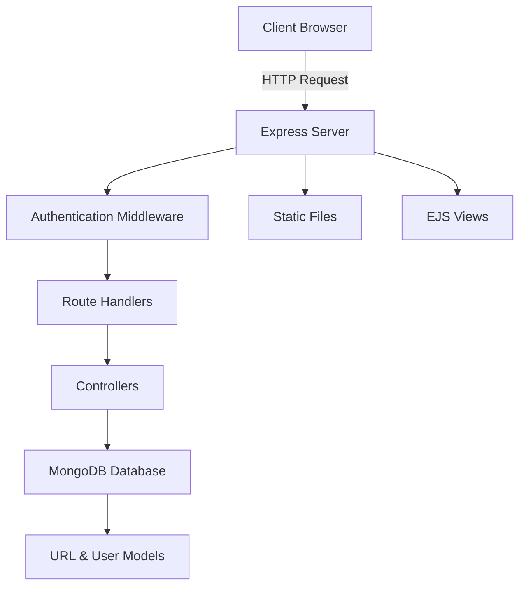

<div align="center">

# 🔗 Shourl

### *A modern, minimalist URL shortener service*


---

**Transform long URLs into sleek, shareable links with advanced analytics and user management.**

[🚀 Live Demo](https://shourl-six.vercel.app/) • [📖 Documentation](#features) • [🛠️ Installation](#installation)

### 🧪 **Test Credentials**
Try the live demo with these test accounts:

| Role | Email | Password |
|------|-------|----------|
| **Admin** | `admin@gmail.com` | `3007` |
| **User** | `user1@gmail.com` | `3007` |

</div>

## ✨ Features

<table>
<tr>
<td width="50%">

### 🔐 **User Authentication**
- Secure registration & login
- JWT-based session management
- Password encryption with bcrypt

### 📊 **Analytics Dashboard**
- Real-time click tracking
- Visit history visualization
- User-specific URL management

</td>
<td width="50%">

### ⚡ **URL Shortening**
- Lightning-fast URL generation
- Custom short ID creation
- Automatic redirect handling

### 🎨 **Modern Interface**
- Clean, responsive design
- EJS templating engine
- Intuitive user experience

</td>
</tr>
</table>

## 🏗️ Architecture



## 🚀 Installation

### Prerequisites
- Node.js (v16 or higher)
- MongoDB database
- npm or yarn

### Quick Start

```bash
# Clone the repository
git clone https://github.com/lohanivaibhav4/Shourl.git
cd Shourl

# Install dependencies
npm install

# Configure environment variables
cp .env.example .env
# Edit .env with your MongoDB URI and JWT secret

# Start the development server
npm start
```

### Environment Variables

```env
MONGO_URI=mongodb://localhost:27017/shourl
JWT_SECRET=your-secret-key
PORT=3000
```

## 📁 Project Structure

```
Shourl/
├── 📁 controllers/     # Request handlers
├── 📁 middlewares/     # Custom middleware
├── 📁 models/          # Database schemas
├── 📁 routes/          # API endpoints
├── 📁 views/           # EJS templates
├── 📁 public/          # Static assets
├── 📁 services/        # Business logic
├── 🔧 index.js         # App entry point
├── 🔧 db.js           # Database connection
└── 📦 package.json     # Dependencies
```

## 🔧 API Endpoints

<details>
<summary><b>Authentication Routes</b></summary>

| Method | Endpoint | Description |
|--------|----------|-------------|
| `POST` | `/user/register` | Register new user |
| `POST` | `/user/login` | User login |
| `POST` | `/user/logout` | User logout |

</details>

<details>
<summary><b>URL Management Routes</b></summary>

| Method | Endpoint | Description |
|--------|----------|-------------|
| `POST` | `/url` | Create short URL |
| `GET` | `/url/:shortId` | Redirect to original URL |
| `GET` | `/url/analytics/:shortId` | Get URL analytics |

</details>

## 🛠️ Tech Stack

<div align="center">

| Category | Technology |
|----------|------------|
| **Backend** | Node.js, Express.js |
| **Database** | MongoDB, Mongoose |
| **Authentication** | JWT, bcrypt |
| **Templating** | EJS, Express-EJS-Layouts |
| **Utilities** | NanoID, UUID, dotenv |

</div>

## 🎯 Usage Examples

### Creating a Short URL
```javascript
// POST /url
{
  "originalUrl": "https://example.com/very-long-url-here"
}

// Response
{
  "shortId": "abc123",
  "shortUrl": "http://localhost:3000/abc123",
  "originalUrl": "https://example.com/very-long-url-here"
}
```

### Accessing Analytics
Visit `/url/analytics/abc123` to view detailed click statistics and visit history.

## 🤝 Contributing

I welcome contributions! Please follow these steps:

1. 🍴 Fork the repository
2. 🌿 Create a feature branch (`git checkout -b feature/amazing-feature`)
3. 💾 Commit your changes (`git commit -m 'Add amazing feature'`)
4. 📤 Push to the branch (`git push origin feature/amazing-feature`)
5. 🔄 Open a Pull Request

## 📄 License

This project is licensed under the **ISC License** - see the [LICENSE](LICENSE) file for details.

## 👨‍💻 Author

**Vaibhav Lohani**
- GitHub: [@lohanivaibhav4](https://github.com/lohanivaibhav4)

---

<div align="center">

**⭐ Star this repository if you found it helpful!**

Made with ❤️ and ☕

</div>
